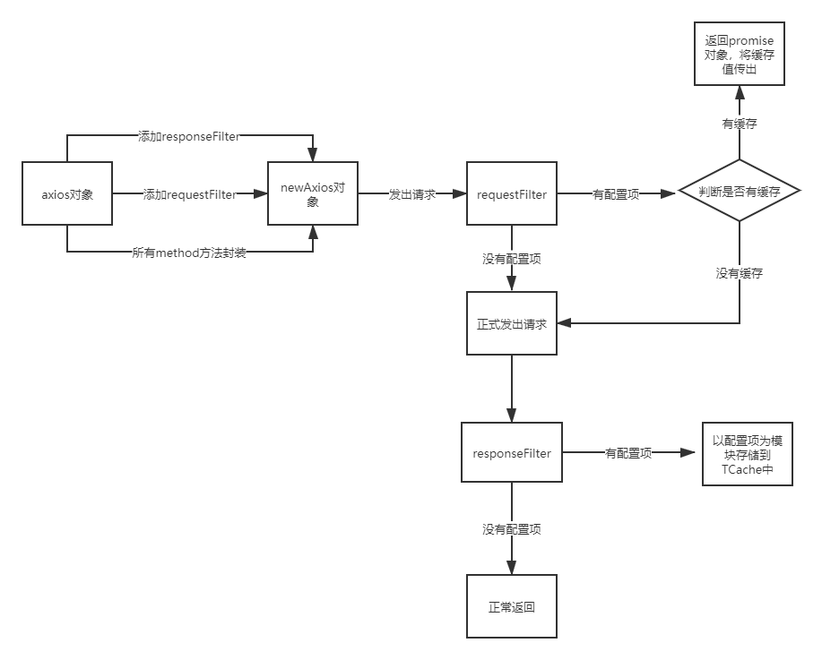

# T-HTTP-Cache

<div align="center">

An out-of-box interface management solution for enterprise applications .

[](https://dev.azure.com/ant-design/ant-design-pro/_build/latest?definitionId=1?branchName=master)   [](https://david-dm.org/ant-design/ant-design-pro) [](https://david-dm.org/ant-design/ant-design-pro?type=dev)

[![Gitter](https://img.shields.io/gitter/room/ant-design/pro-english.svg?style=flat-square&logoWidth=20&logo=data%3Aimage%2Fsvg%2Bxml%3Bbase64%2CPD94bWwgdmVyc2lvbj0iMS4wIiBlbmNvZGluZz0iVVRGLTgiPz4NCjxzdmcgeG1sbnM9Imh0dHA6Ly93d3cudzMub3JnLzIwMDAvc3ZnIiB4bWxuczp4bGluaz0iaHR0cDovL3d3dy53My5vcmcvMTk5OS94bGluayIgd2lkdGg9IjEyMzUiIGhlaWdodD0iNjUwIiB2aWV3Qm94PSIwIDAgNzQxMCAzOTAwIj4NCjxyZWN0IHdpZHRoPSI3NDEwIiBoZWlnaHQ9IjM5MDAiIGZpbGw9IiNiMjIyMzQiLz4NCjxwYXRoIGQ9Ik0wLDQ1MEg3NDEwbTAsNjAwSDBtMCw2MDBINzQxMG0wLDYwMEgwbTAsNjAwSDc0MTBtMCw2MDBIMCIgc3Ryb2tlPSIjZmZmIiBzdHJva2Utd2lkdGg9IjMwMCIvPg0KPHJlY3Qgd2lkdGg9IjI5NjQiIGhlaWdodD0iMjEwMCIgZmlsbD0iIzNjM2I2ZSIvPg0KPGcgZmlsbD0iI2ZmZiI%2BDQo8ZyBpZD0iczE4Ij4NCjxnIGlkPSJzOSI%2BDQo8ZyBpZD0iczUiPg0KPGcgaWQ9InM0Ij4NCjxwYXRoIGlkPSJzIiBkPSJNMjQ3LDkwIDMxNy41MzQyMzAsMzA3LjA4MjAzOSAxMzIuODczMjE4LDE3Mi45MTc5NjFIMzYxLjEyNjc4MkwxNzYuNDY1NzcwLDMwNy4wODIwMzl6Ii8%2BDQo8dXNlIHhsaW5rOmhyZWY9IiNzIiB5PSI0MjAiLz4NCjx1c2UgeGxpbms6aHJlZj0iI3MiIHk9Ijg0MCIvPg0KPHVzZSB4bGluazpocmVmPSIjcyIgeT0iMTI2MCIvPg0KPC9nPg0KPHVzZSB4bGluazpocmVmPSIjcyIgeT0iMTY4MCIvPg0KPC9nPg0KPHVzZSB4bGluazpocmVmPSIjczQiIHg9IjI0NyIgeT0iMjEwIi8%2BDQo8L2c%2BDQo8dXNlIHhsaW5rOmhyZWY9IiNzOSIgeD0iNDk0Ii8%2BDQo8L2c%2BDQo8dXNlIHhsaW5rOmhyZWY9IiNzMTgiIHg9Ijk4OCIvPg0KPHVzZSB4bGluazpocmVmPSIjczkiIHg9IjE5NzYiLz4NCjx1c2UgeGxpbms6aHJlZj0iI3M1IiB4PSIyNDcwIi8%2BDQo8L2c%2BDQo8L3N2Zz4%3D)](https://gitter.im/ant-design/pro-english?utm_source=badge&utm_medium=badge&utm_campaign=pr-badge) [![Join the chat at https://gitter.im/ant-design/ant-design-pro](https://img.shields.io/gitter/room/ant-design/ant-design-pro.svg?style=flat-square&logoWidth=20&logo=data%3Aimage%2Fsvg%2Bxml%3Bbase64%2CPD94bWwgdmVyc2lvbj0iMS4wIiBlbmNvZGluZz0iVVRGLTgiPz4NCjxzdmcgeG1sbnM9Imh0dHA6Ly93d3cudzMub3JnLzIwMDAvc3ZnIiB4bWxuczp4bGluaz0iaHR0cDovL3d3dy53My5vcmcvMTk5OS94bGluayIgd2lkdGg9IjkwMCIgaGVpZ2h0PSI2MDAiIHZpZXdCb3g9IjAgMCAzMCAyMCI%2BDQo8ZGVmcz4NCjxwYXRoIGlkPSJzIiBkPSJNMCwtMSAwLjU4Nzc4NSwwLjgwOTAxNyAtMC45NTEwNTcsLTAuMzA5MDE3SDAuOTUxMDU3TC0wLjU4Nzc4NSwwLjgwOTAxN3oiIGZpbGw9IiNmZmRlMDAiLz4NCjwvZGVmcz4NCjxyZWN0IHdpZHRoPSIzMCIgaGVpZ2h0PSIyMCIgZmlsbD0iI2RlMjkxMCIvPg0KPHVzZSB4bGluazpocmVmPSIjcyIgdHJhbnNmb3JtPSJ0cmFuc2xhdGUoNSw1KSBzY2FsZSgzKSIvPg0KPHVzZSB4bGluazpocmVmPSIjcyIgdHJhbnNmb3JtPSJ0cmFuc2xhdGUoMTAsMikgcm90YXRlKDIzLjAzNjI0MykiLz4NCjx1c2UgeGxpbms6aHJlZj0iI3MiIHRyYW5zZm9ybT0idHJhbnNsYXRlKDEyLDQpIHJvdGF0ZSg0NS44Njk4OTgpIi8%2BDQo8dXNlIHhsaW5rOmhyZWY9IiNzIiB0cmFuc2Zvcm09InRyYW5zbGF0ZSgxMiw3KSByb3RhdGUoNjkuOTQ1Mzk2KSIvPg0KPHVzZSB4bGluazpocmVmPSIjcyIgdHJhbnNmb3JtPSJ0cmFuc2xhdGUoMTAsOSkgcm90YXRlKDIwLjY1OTgwOCkiLz4NCjwvc3ZnPg%3D%3D)](https://gitter.im/ant-design/ant-design-pro?utm_source=badge&utm_medium=badge&utm_campaign=pr-badge) [](http://umijs.org/) 

</div>

## 目录

[TOC]

## 简介

接口管理,对接口请求进行处理，根据对应配置项进行相关操作。

基于状态管理，根据接口划分出来的一套机制，类似Vue项目中，大量的接口静态数据（ *展示数据，字典数据等* ）被放入到vuex中进行管理，当想要使用时，则去对应的store中调用获取，或者需要重新请求获取资源，需要大量的配置操作，过于繁琐，状态管理是基于项目结构或项目功能为模块进行管理，接口管理是基于接口为模块进行管理，于是接口管理（ *T-Http-Cache* ）的想法诞生。简单实用，方便阅读代码。

请求拦截目前对axios进行封装，具体情况使用说明

其他依赖 T-Cache:[npm地址](https://www.npmjs.com/package/@onlyheartt9/t-cache)    [github地址](https://github.com/onlyheartt9/T-Cache)

## 项目说明

我为何想造另外的轮子？
对接口数据进行缓存，
接口管理机制已上线

## 目录结构说明

暂无

## 架构说明

## 如何运行

```shell
1. yarn
2. yarn build
```

## 如何测试

```shell
1. yarn test
2. open example/lib/test.html
```

## THCache API

#### 例子

```js
import THCache,{TBindAxios} from "t-http-cache";
let thc = new THCache();
axios = TBindAxios(axios);//axios为自己引入的对象，THCache只是做封装处理，全局只执行一次即可，后续axios使用返回的axios对象
let optKey = thc.setOption({
       url:"",
       type:"fuzzy",
       method:"all",
       keepTime:-1
});
axios({
       method:"GET",
       url:"http://jsonplaceholder.typicode.com/users",
       data:{
           firstName: 'Fred',
           lastName: 'Flintstone'
       }
}).then(res=>{
    console.log(res._cacheKey)
});
```

**TBindAxios**

​		对请求进行扩展拦截，初始化必调函数


**THCache.prototype.setOptions     （option[]）=> optKey[]**

设置配置项，可通过构造函数设置，也可以通过setOptions方法设置


**THCache.prototype.setOption          （option） => optKey**

设置单个配置项,返回对应optKey，可用于对option进行其他操作


**THCache.prototype.getOptionByKey   (optKey)=> option**

根据optKey获取对应option对象


**THCache.prototype.removeOptionByKey    (optKey)=> void**

根据optKey删除对应option对象


**THCache.prototype.getCacheByKey  		(cacheKey)=> object**

根据cacheKey获取对应的缓存对象


**THCache.prototype.setDebugger**

设置debug模式。控制台输出对应值，方便调试


## Option Config

```js
//OPTION参数模板
{
  url: "/aaa",//需要拦截处理的路径
  type: "precise" || "fuzzy",//拦截请求的模式，是精准匹配还是模糊匹配，默认precise
  keepTime: 3000 || "forever"||"trigger"||-1,//缓存时效配置，分为有限，无限和触发三种模式，默认3000
  local: "defalut" || "storage",//缓存存储位置配置，可以存在闭包内或localStorage中
  excludes: ["/aaa/bbb"],//模糊匹配时使用，对指定url不再拦截处理
  excludeAttrs:["name"]||"all",//对拦截到的请求，相关参数不做匹配处理
  method: "get"||"all"//请求格式配置项，all为所有格式
  dataFormat:(data)=>data //数据预处理方法，对返回值进行处理
}

```

## 流程图

**Axios拦截处理**


